# (C# 코딩) SimplePaint

## 개요
- C# 프로그래밍 학습
- 1줄 소개: C#으로 구현한 그림판 
- 사용한 플랫폼:
  - C#, .NET Windows Forms, Visual Studio, GitHub
- 사용한 컨트롤:
  - label, button,trackbar, picturebox, Combobox
- 사용한 기술과 구현한 기능
  - Combobox에서 색상 선택 기능 구현
  - Trackbar에서 선굵기 선택 기능 구현
  - Button에서 도형 선택 기능 구현
  - SaveFileDialog를 이용한 파일 저장 기능 구현
  - 마우스 드래그를 이용한 그림 그리기 기능 구현
  - 직선, 사각형, 원 그리기 기능 구현
  - 그림판 캔버스 초기화 기능 구현
  - 이미지 파일 저장 기능 구현
  - 

  
  

## 실행 화면 (과제1)
-  과제1 코드의 실행 스크린샷

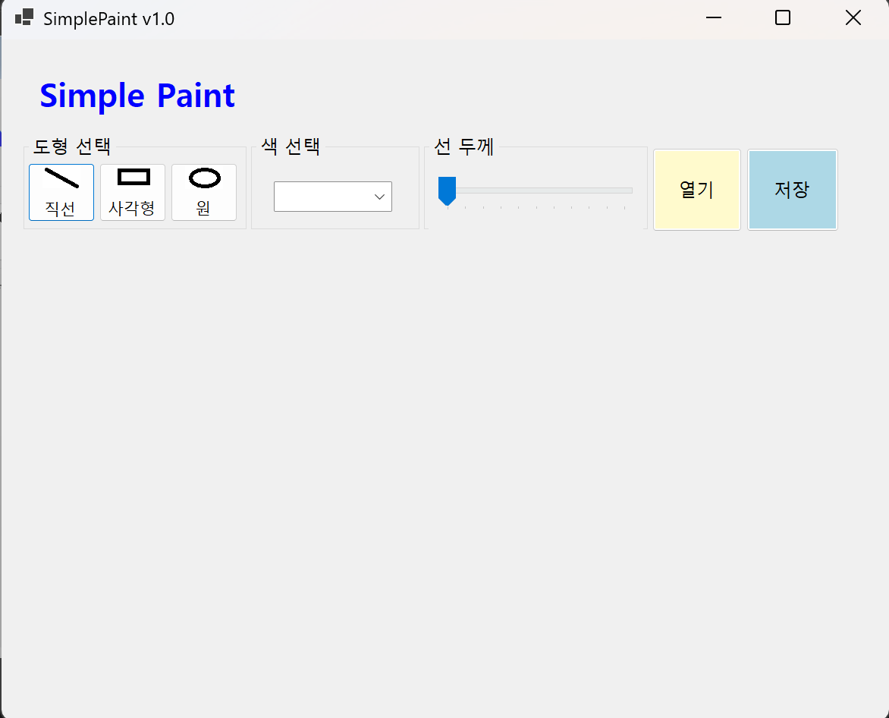
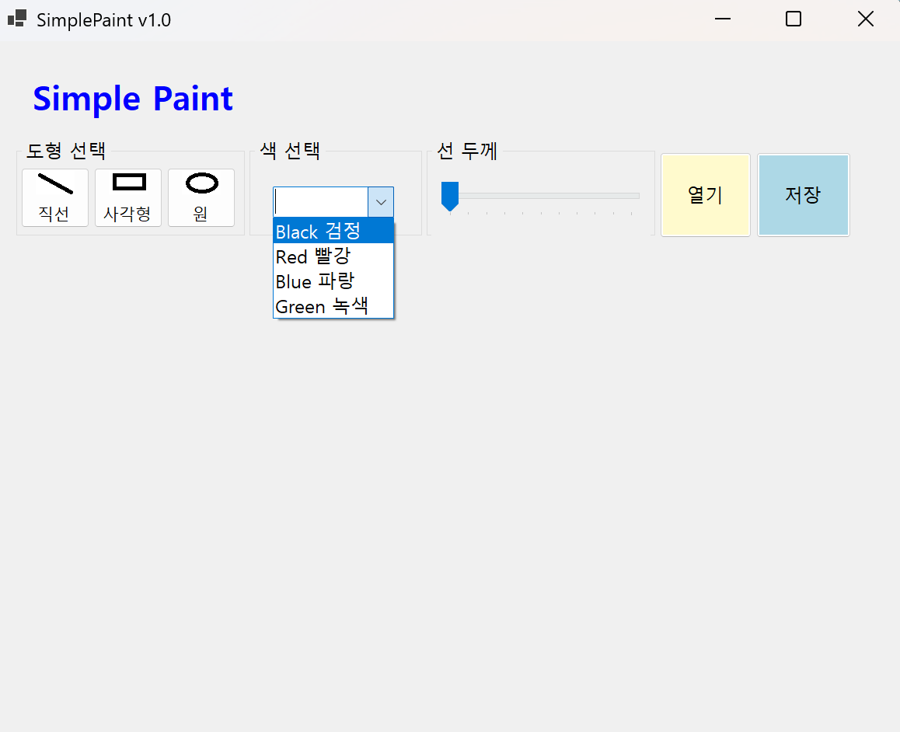
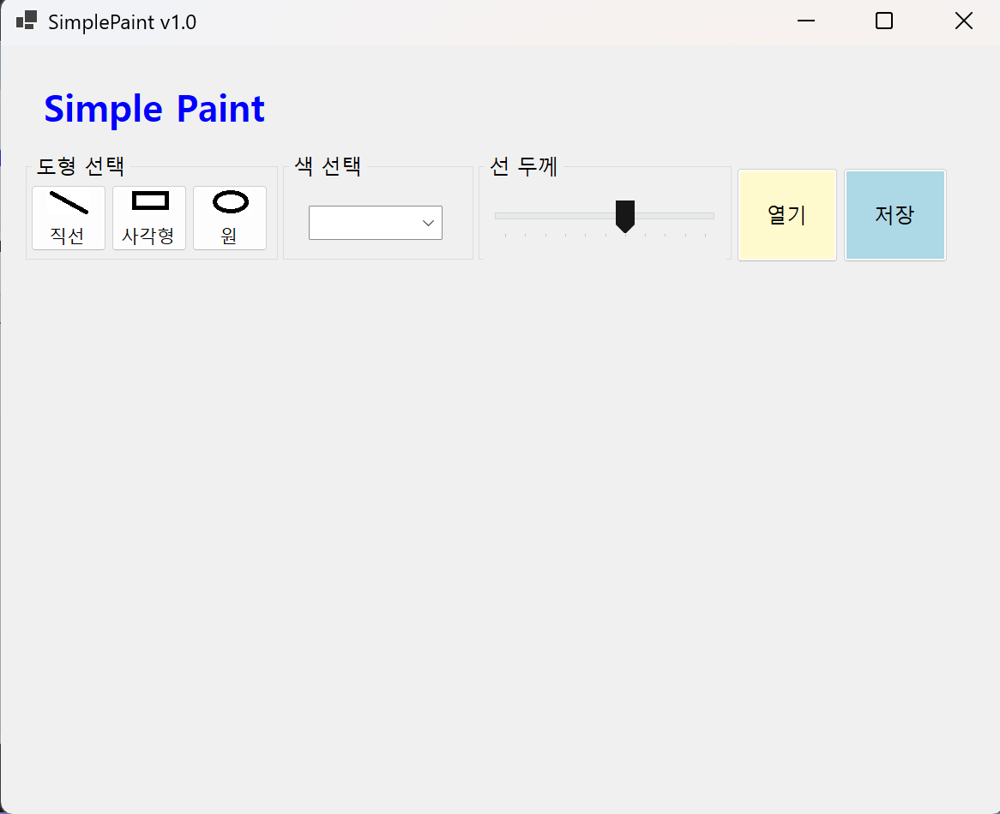

- 과제 내용
  - UI 구성
    - ▶GUI 설계
    - ▶컨트롤 배치
  - 컨트롤의 기본 기능 확인과 구현
    - ▶컨트롤에서 기본적으로 제공하는 기능 구동 확인
    - ▶ 도형선택, 색상선택, 선굵기선택 기능 구현

- 구현 내용과 기능 설명
  - UI 구성하고 컨트롤 배치 후 이름을 설정했습니다.
  - Combobox에서 색상 선택 기능(빨강, 파랑, 녹색, 검정) 구현했습니다.
  - button에서 도형 선택 기능(직선, 사각형, 원) 구현했습니다.
  - Trackbar에서 선굵기 선택 기능(두께 1-10) 구현했습니다.
  - 열기, 저장 버튼 구현했습니다.
  

## 실행 화면 (과제2)
-  과제2 코드의 실행 스크린샷

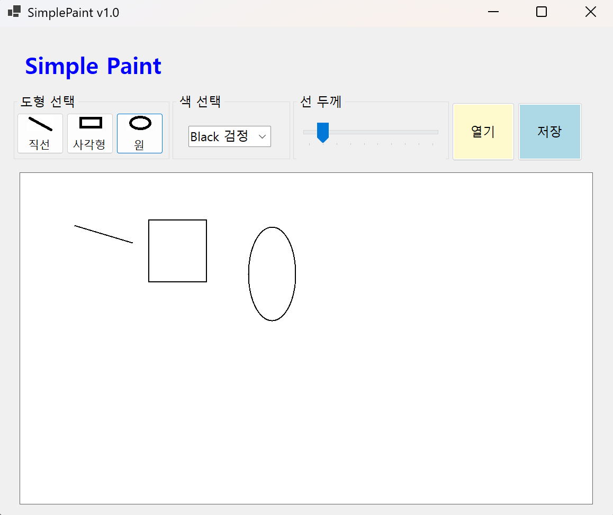
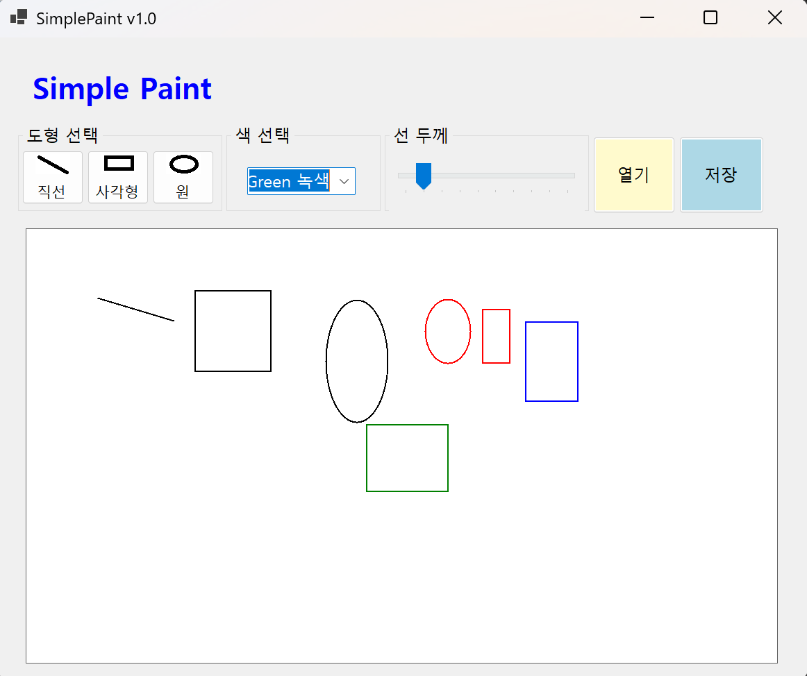
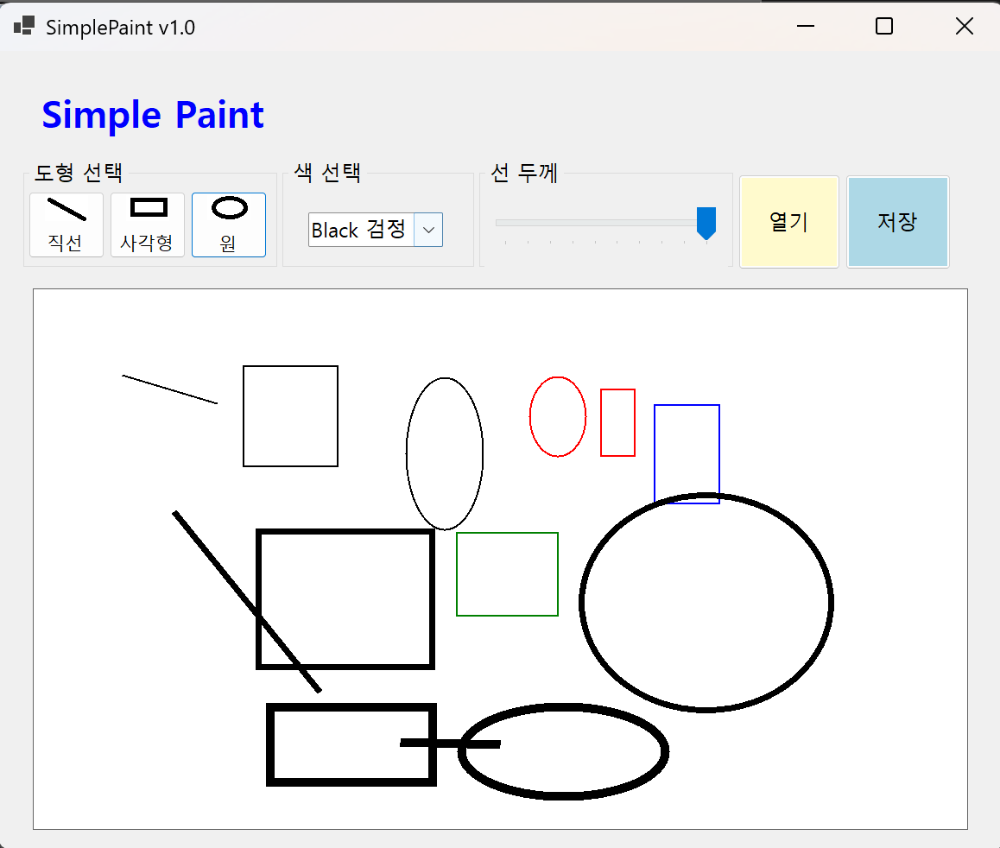
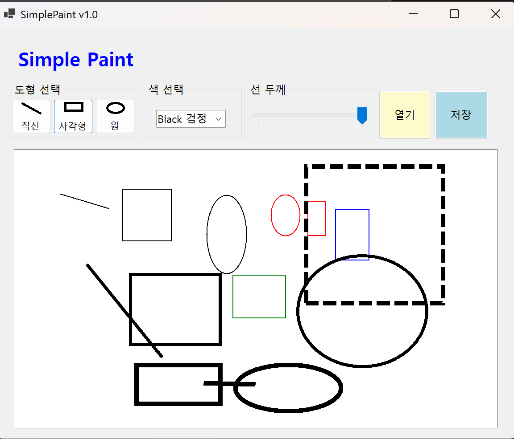

- 과제 내용
  - 마우스 드래그를 이용한 그림 그리기 기능 구현
  - 직선, 사각형, 원 그리기 기능 구현

- 구현 내용과 기능 설명
  - 마우스 드래그를 이용한 그림 그리기 기능 구현했습니다.
  - 도형 선택 후 마우스 드래그로 도형을 그릴 수 있고 드래그 시 점선으로 도형이 나타납니다.
  - 직선, 사각형, 원 그리기 기능 구현했습니다.
  - 색상 변경, 선굵기 변경 후 도형을 그리면 선택한 색상과 선굵기로 도형이 그려집니다.
  - 그림판 캔버스 초기화 기능 구현했습니다.
  
    

## 실행 화면 (과제3)
-  과제3 코드의 실행 스크린샷

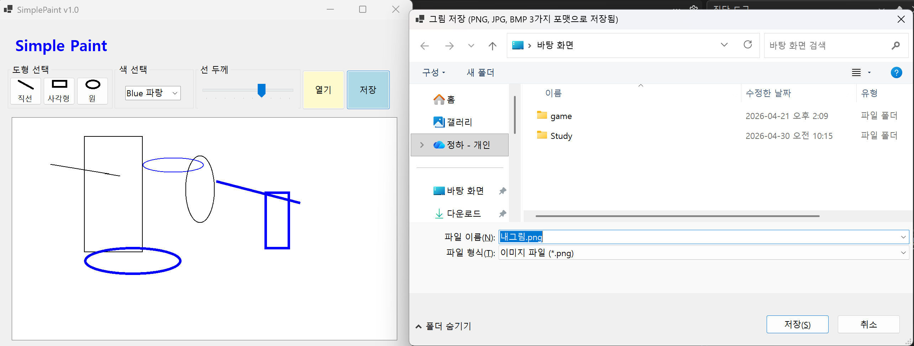
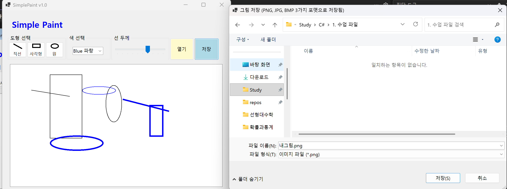
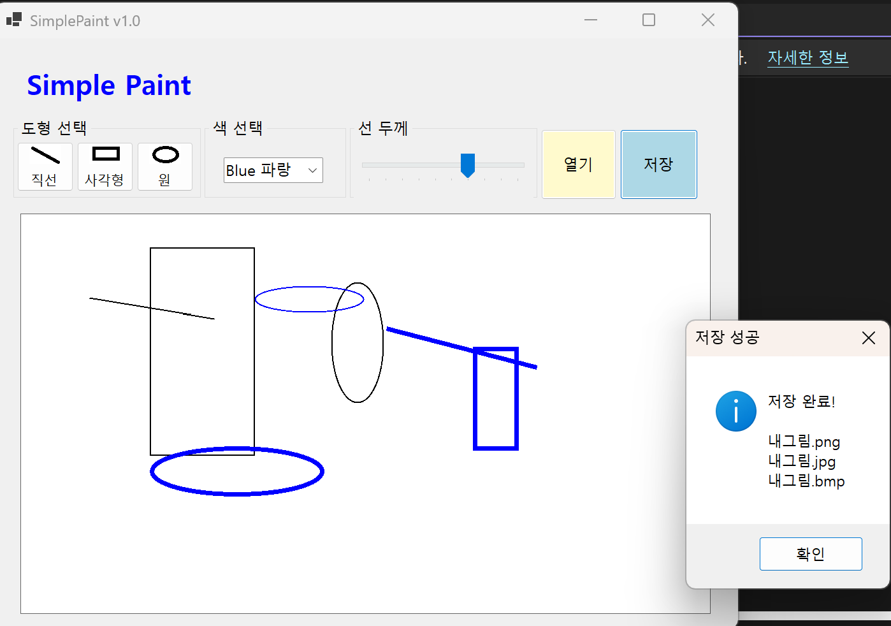
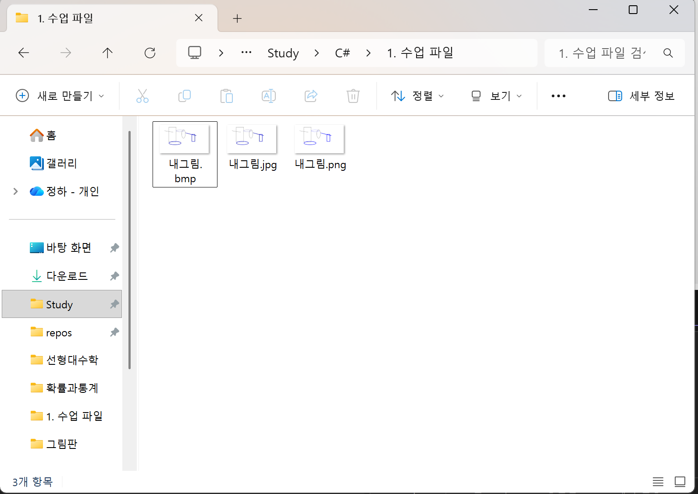

- 과제 내용
  - 파일 저장을 위한 대화상자인 SaveFileDialog 사용
  - 3가지 포맷으로 저장
    - ▶ .png
    - ▶ .jpg
    - ▶ .bmp

- 구현 내용과 기능 설명
  - SaveFileDialog를 이용한 파일 저장 기능 구현했습니다.
  - 저장 버튼 클릭 시 SaveFileDialog가 나타나고 파일 이름과 저장 위치를 선택할 수 있습니다.
  - 파일 저장 시 .png, .jpg, .bmp 포맷으로 저장할 수 있도록 구현했습니다.
  
  

## 실행 화면 (과제4)
-  과제4 코드의 실행 스크린샷

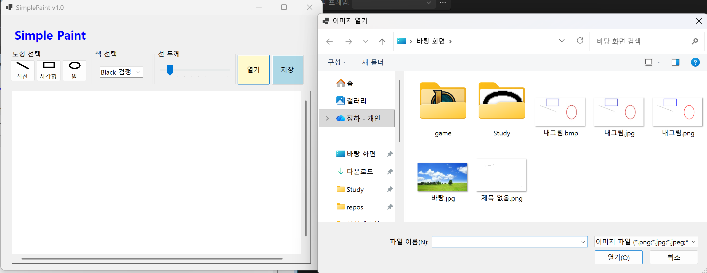

- 과제 내용
  - 외부에서 이미지 파일을 읽어 들여서 캔버스로 사용
  - 이미지 크기에 맞춰 캔버스 크기 조정
  - 이미지 크기가 큰 경우 스크롤바 만들기
  - 확대/축소 기능 넣기

- 구현 내용과 기능 설명
  - 